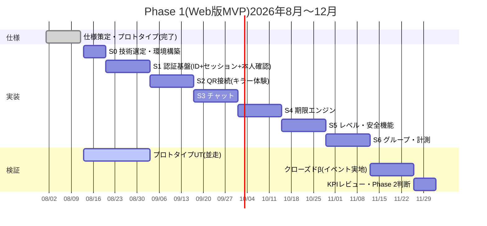

# PersonalLink プロジェクト進行表

**Version 0.1 / 2026-08-12 起点**

本書がプロジェクトの単一の進行管理文書。スプリント終了ごとに Status と日付を更新する(運用ルールは §8)。

- Status 凡例: ✅ 完了 / 🔄 進行中 / ⬜ 未着手 / ⏸ 保留
- 担当 凡例: 👤 オーナー(判断・実地・対外)/ 🤖 AI開発(実装・テスト・文書)

---

## 1. 現在地(2026-08-12 時点)

**Phase 1(Web版MVP)— S1前半 完了。S1後半(本人確認)のみ認証方式の決定待ち。**

| 実績 | 完了日 |
|---|---|
| ✅ 構想書 v0.1(founding document) | 08-12 |
| ✅ 画面設計書 = MVP仕様書 v0.1.3(全20画面・設計判断D-1〜D-13・状態遷移・KPI設計) | 08-12 |
| ✅ データモデル v0.1(テーブル定義・不変条件1〜9) | 08-12 |
| ✅ デザイン言語「GLASS-HUD」v0.2(白ベース・AR-ready透過原則) | 08-12 |
| ✅ クリック可能プロトタイプ v0.2(コアループ+送信取り消し+ミュート、Playwright検証済み) | 08-12 |
| ✅ 技術選定メモ(T-1〜T-11) | 08-12 |
| ✅ Next.js 16 アプリ scaffold(`web/`)+ lint / typecheck / build 通過 | 08-12 |
| ✅ WebAuthnスパイク実装・自動検証 green → **Passkey見送りにより撤去**(知見は docs/06 に保管) | 08-12 |
| ✅ CI(GitHub Actions: lint / typecheck / build / unit / E2E) | 08-12 |
| ✅ **S1前半**: DBスキーマ / @ID取得(IME対応)/ DBセッション / 端末管理・全端末ログアウト / プロフィール | 08-12 |
| ✅ GLASS-HUD を実アプリへ適用(背景ストリーム+透過パネル) | 08-12 |
| ✅ 開発用の仮ログイン(本番無効。S2以降を先行させるため) | 08-12 |

**▶ 次のアクション:**
1. 🤖 **S2(QR接続 = キラー体験)へ着手可能** — 仮ログインがあるため認証方式の決定を待たない
2. 👤 **オーナー: 認証方式の決定**([D-7](docs/01-screen-design.md) / [T-4](docs/05-tech-stack.md))— S1後半のブロッカー
3. 👤 Vercel / Neon アカウント(デプロイ時に必要。**ローカル開発と CI は PGlite で動くため急がない**)

> 🗄️ **2026-08-12 の決定**: **Passkey は見送り**(運用が面倒との判断)。認証方式は未定。
> これに伴い **「本番ドメインの確定」ブロッカーは解除**された(RP ID 依存は Passkey 固有だったため)。
> 経緯と知見: [docs/06-webauthn-spike.md](docs/06-webauthn-spike.md)

---

## 2. 全体ロードマップ(構想書 §17 対応)

| Phase | 内容 | 状態 | 時期(目安) |
|---|---|---|---|
| **Phase 1** | **Web版MVP** | 🔄 S1前半まで実装済み | **2026 Q3〜Q4** |
| Phase 2 | PWA化(ホーム画面追加・Web Push本格化・オフライン) | ⬜ | 2026 Q4〜2027 Q1 |
| Phase 3 | Universal Identity(マルチデバイス同期・E2EE導入 = D-9の解消) | ⬜ | 2027〜 |
| Phase 4 | AIによるコミュニケーション支援 | ⬜ | Phase 3 の後 |
| Phase 5 | ホテル・カフェ・駅などへの共有端末展開 | ⬜ | ユーザー基盤確立後 |
| Phase 6 | 専用端末・ウェアラブル・AR(GLASS-HUDはこのための布石) | ⬜ | 十分な資本確保後 |

---

## 3. Phase 1 スケジュール(仮置き)

前提: **1スプリント = 2週間、オーナー1名 + AI開発体制**。日付は専任稼働の仮置きであり、**本体は「順序と完了条件」**。遅れたら日付だけずらし、順序と完了条件は守る。

### マイルストーン一覧

| # | マイルストーン | 期間(仮) | Status | 完了条件(DoD) | 意味 |
|---|---|---|---|---|---|
| M0 | 仕様策定・プロトタイプ | 〜08/12 | ✅ | 仕様書v0.1.3・プロトタイプv0.2 | 作るものが確定 |
| M1 | S0 技術選定・環境構築 | 08/12 | ✅ | 実装・CI green・技術判断の文書化 | 開発が回り始める |
| M2 | S1 認証基盤 | 08/12〜 | 🔄 | 登録→ログアウト→再ログイン→回復 が通る | 前半✅。後半は**認証方式の決定待ち** |
| M3 | S2 QR接続 | 09/03〜09/16 | ⬜ | 実機2台で60秒以内に接続成立 | **キラー体験がデモ可能に** |
| M4 | S3 チャット | 09/17〜09/30 | ⬜ | 2台間リアルタイム往復+取り消し+ミュート | 会話が成立する |
| M5 | S4 期限エンジン | 10/01〜10/14 | ⬜ | 状態遷移の全パターンをテストで網羅 | **コアループ完成(α版)** |
| M6 | S5 レベル・安全機能 | 10/15〜10/28 | ⬜ | 不変条件1〜9の自動テスト green | 安心して人に渡せる |
| M7 | S6 グループ・計測 | 10/29〜11/11 | ⬜ | KPI5指標が集計できる | **機能完成(β候補)** |
| M8 | クローズドβ | 11/12〜11/25 | ⬜ | イベント1回・20〜30名で実地利用 | 初の実ユーザー |
| M9 | KPIレビュー | 11/26〜12/02 | ⬜ | 5指標の実測値でGO/改善判断 | Phase 2への関門 |

---

## 4. スプリント詳細

### S0 技術選定・環境構築(1週間)

| タスク | 担当 | Status |
|---|---|---|
| 技術選定メモ作成([docs/05-tech-stack.md](docs/05-tech-stack.md))— T-1〜T-11を決定 | 🤖 | ✅ |
| リポジトリ構成(`web/` 作成、lint・typecheck・build) | 🤖 | ✅ |
| CI(GitHub Actions: lint / typecheck / build / unit / E2E) | 🤖 | ✅ |
| WebAuthnスパイク実装+自動検証 → **見送り決定により撤去** | 🤖 | ✅ |
| スパイク報告([docs/06-webauthn-spike.md](docs/06-webauthn-spike.md)。現在は参考資料) | 🤖 | ✅ |
| Vercel アカウント | 👤 | ⬜ S1中 |
| Neon(Postgres)アカウント | 👤 | ⬜ S1中 |
| ~~本番ドメイン確定~~ / ~~実機でのPasskey検証~~ | — | ❌ Passkey見送りにより不要 |

**DoD**: 実装が動き、push→CI が green。技術判断が文書化されている。→ **達成**
(CI実績: lint / typecheck / build と E2E がともに success)

> 🗄️ **Passkey 見送り(2026-08-12)にともなう計画変更**
> - S0 で格上げした「ドメイン確定を S1 ブロッカーに」は**撤回**(RP ID 依存が消えたため)
> - 代わりに **認証方式の決定**が S1 のブロッカーになった([D-7](docs/01-screen-design.md))

### S1 認証基盤(A-1〜A-4, F-3)

**前半 — 認証方式の決定を待たずに着手できる** ✅ 完了

| タスク | 担当 | Status |
|---|---|---|
| DBスキーマ(users / sessions / profiles / handle_reservations)+ マイグレーション | 🤖 | ✅ |
| @ID取得(重複チェック・予約語・部分UNIQUE・CHECK制約)+ A-2 IME対応 | 🤖 | ✅ |
| **DBセッション**(発行・検証・revoke・トークンはハッシュ保存)— 方式非依存(T-4) | 🤖 | ✅ |
| 端末・セッション管理画面+全端末ログアウト(F-3) | 🤖 | ✅ |
| プロフィール設定(A-4、L0/L4のカラム分離) | 🤖 | ✅ |
| GLASS-HUD の適用(背景ストリーム+透過パネル) | 🤖 | ✅ |
| 開発用の仮ログイン(本番無効。S2以降を先行させるため) | 🤖 | ✅ |
| テスト: unit 21件(DB制約・ID検証・仮ログインのガード)+ E2E 10件 | 🤖 | ✅ |

**後半 — 認証方式の決定が必要(ブロック中)**

| タスク | 担当 | Status |
|---|---|---|
| 👤 **認証方式の決定**(D-7 / T-4) | 👤 | ⬜ **ブロッカー** |
| credentials スキーマ確定 + 本人確認の実装(A-3) | 🤖 | ⬜ 決定待ち |
| ログイン導線(A-1)+ アカウント回復フロー(回復時に全端末ログアウト) | 🤖 | ⬜ 決定待ち |
| 仕様書 D-7 / A-1 / A-3 / F-3 とデータモデルの更新 | 🤖 | ⬜ 決定待ち |

**DoD**: 登録→ログアウト→再ログイン→回復 が通る。登録所要60秒以内。

> ✅ **前半完了により、S2以降は認証方式の決定を待たずに進められる。**
> 開発用の仮ログイン(@ID を入れるだけ、本番では無効)を用意した。セッション層は方式非依存なので、
> 方式が決まったら本物の本人確認を差し込むだけで済む。

### S2 QR接続(B-1〜B-5)

| タスク | 担当 | Status |
|---|---|---|
| qr_tokens(署名付きワンタイム・5分失効・consumed管理) | 🤖 | ⬜ |
| マイQR表示(期限チップ・自動更新・オフライン注記) | 🤖 | ⬜ |
| QR読み取り(カメラ)+ @ID直接入力フォールバック | 🤖 | ⬜ |
| 未登録読み取り→接続チケット保持→登録→接続の動線 | 🤖 | ⬜ |
| 接続確認画面(B-4)・成立演出(B-5)・ホーム(B-1) | 🤖 | ⬜ |
| 計測イベント実装開始(qr_displayed / qr_scanned / connection_established) | 🤖 | ⬜ |

**DoD**: 実機2台で「QR表示→読み取り→成立→成立通知」が60秒以内。失効・自己読み取り・既接続のエッジケースが仕様どおり。

### S3 チャット(C-1, C-3, C-4)

| タスク | 担当 | Status |
|---|---|---|
| messages 送受信(まずポーリング→SSE/WSへ) | 🤖 | ⬜ |
| システムメッセージ(成立・レベル・期限イベント) | 🤖 | ⬜ |
| 送信取り消し(D-12: 24h・物理削除・無通知)+自分側削除 | 🤖 | ⬜ |
| ミュートメッセージ(D-13: サーバー側通知抑止・受信側非表示) | 🤖 | ⬜ |
| チャットIME対応(変換確定Enterで誤送信しない 等) | 🤖 | ⬜ |

**DoD**: 2台間でリアルタイム往復。取り消し・ミュートが仕様(D-12/D-13)どおり。既読情報が存在しないことをAPIレベルで確認。

### S4 期限エンジン(D-1〜D-3)

| タスク | 担当 | Status |
|---|---|---|
| 状態遷移ジョブ(分単位バッチ+読み取り時遅延評価の二重化) | 🤖 | ⬜ |
| renewal_choices と評価マトリクス(仕様§3)の実装 | 🤖 | ⬜ |
| 「継続しない」の秘匿保証(APIが相手に一切返さないこと) | 🤖 | ⬜ |
| 恒久化(双方継続で即時)・grace 48h・復活 | 🤖 | ⬜ |
| 期限24h前通知(アプリ内。Web PushはPhase 2本格化) | 🤖 | ⬜ |

**DoD**: §3の状態遷移とマトリクスの**全パターンが自動テストで網羅**され green。タイミングリーク(早期終了で拒否がバレる)がないこと。

### S5 レベル・安全機能(C-2, E-1, F-1, F-2)

| タスク | 担当 | Status |
|---|---|---|
| level_proposals / level_grants(提案→承諾、拒否状態を持たない) | 🤖 | ⬜ |
| 写真・ファイル送受信(L2ゲート+ストレージ) | 🤖 | ⬜ |
| L4詳細プロフィール(相互公開・一方的停止) | 🤖 | ⬜ |
| ブロック(silent)・通報(同意時のみ証跡添付) | 🤖 | ⬜ |
| 設定(プロフィールL0/L4・QRデフォルト期限・通知) | 🤖 | ⬜ |
| データエクスポート(JSON一括)・アカウント削除 | 🤖 | ⬜ |

**DoD**: データモデルの**不変条件1〜9が自動テストで保証**される。silent blockが受信側の見た目を一切変えないこと。

### S6 グループ・計測(G-1, G-2)

| タスク | 担当 | Status |
|---|---|---|
| groups / group_members / group_messages(招待→参加確認制) | 🤖 | ⬜ |
| グループチャット(レベル非依存、1対1と独立) | 🤖 | ⬜ |
| 計測イベント全実装+簡易ダッシュボード(KPI5指標) | 🤖 | ⬜ |
| `docs/analytics-events.md`(イベントスキーマ確定) | 🤖 | ⬜ |

**DoD**: KPI5指標(§5)がダッシュボードで見られる。計測にメッセージ本文が含まれないこと(D-10)の確認。

### M8 クローズドβ(イベント実地)

| タスク | 担当 | Status |
|---|---|---|
| 対象イベント選定・許可取り(趣味系・20〜30名規模) | 👤 | ⬜ |
| β参加者向け説明1枚(「何が共有されないか」中心) | 🤖👤 | ⬜ |
| B-4文言・期限7日デフォルトの実地検証計画 | 🤖 | ⬜ |
| 当日運用(現地でQR交換を観察)→ 気づきログ | 👤 | ⬜ |

### M9 KPIレビュー

M8の実測をもって §5 の仮目標を実数で置き換え、**Phase 2(PWA化)GO / 改善continueを判断**する。

---

## 5. KPIゲート(構想書§16 → いつ・何で判断するか)

| KPI | 計測開始 | 初回判断 | 仮目標(M8で実測後に再設定) |
|---|---|---|---|
| QR接続率 | S2〜 | M8 | 60%以上(QRを見せた場の成立率) |
| 初回メッセージ率 | S3〜 | M8 | 50%以上(成立後24hの双方向率) |
| 期限後継続率 | S4〜 | M9 | 20〜40%を健全域と仮定※ |
| 再利用率 | M8〜 | M9 | 30%以上(7日以内の2回目利用) |
| LINE移行率(代理指標) | M8〜 | M9 | 終了時アンケートで実態把握から開始 |

※ 継続率は高いほど良いわけではない。100%なら期限機能が無意味、0%なら関係が育っていない。「残したい関係だけ残る」中間帯が健全、という仮説をM8で検証する。

---

## 6. 並走レーン(スプリントに紐づかない作業)

| 作業 | 担当 | 期限目安 | Status |
|---|---|---|---|
| プロトタイプのユーザーテスト(5名・B-4文言とD-2選択率の定性確認) | 👤 | S2完了まで | ⬜ |
| サービス名の商標・ドメイン確認(「PersonalLink」続投可否) | 👤 | S3完了まで | ⬜(Passkey見送りにより通常の優先度へ戻した) |
| 利用規約・プライバシーポリシー(最小収集を明文化) | 👤🤖 | M8前必須 | ⬜ |
| βイベントの候補リストアップ | 👤 | S5完了まで | ⬜ |

---

## 7. リスク登録簿

| リスク | 影響 | 対策 | 状態 |
|---|---|---|---|
| **認証方式が未定** | S1後半とM2が進まない。方式次第でD-7・A-1コピー・収集する個人情報の範囲が変わる | 前半(セッション層)を先行実装。決定が遅れる場合は仮ログインでS2以降を進める | ⬜ **オーナー判断待ち** |
| ~~WebAuthn実機互換~~ / ~~RP ID確定前の公開~~ | — | Passkey見送りにより消滅 | ✅ 解消 |
| 回帰テストの負荷 | 手戻り検知が遅れる | CI(lint/typecheck/build/E2E)を構築済み。実地で green を確認 | ✅ 対策済み |
| カメラ/QR読み取りのブラウザ差 | キラー体験の成立率低下 | S2冒頭にスパイク。@ID入力フォールバックは仕様済み | ⬜ 未検証 |
| iOSのWeb Push制約(PWA必須) | 期限24h前通知が届かない | MVPはアプリ内通知中心と割り切り済み(仕様§5)。Phase 2で解消 | ✅ 仕様で吸収済み |
| 1人体制での実地テスト負荷 | M8の質 | イベント1回に絞る。観察項目を事前に3つに限定 | — |
| スケジュール遅延 | 士気・判断の遅れ | 日付でなく順序とDoDを守る運用(§3前提) | — |

---

## 8. 進行表の運用ルール

1. **スプリント終了ごと**に本書のStatusを更新し、READMEの「現在地」を同期する
2. 仕様の変更は先に `docs/01-screen-design.md`(+必要ならデータモデル)へ反映し、本書はタスクだけを持つ(仕様の二重管理をしない)
3. 日付がずれたら日付だけを直す。**順序とDoDは原則動かさない**(動かすときは理由を変更履歴に書く)
4. 変更履歴は本書末尾に追記

## 変更履歴

| 日付 | 内容 |
|---|---|
| 2026-08-12 | 初版作成(M0完了を反映、S0〜M9の計画を設定) |
| 2026-08-12 | S0実装分を完了に更新。**計画変更**: WebAuthnのRP ID依存が判明したため、ドメイン確定を並走レーンからS1ブロッカーへ格上げし、ステージングを固定ドメイン必須とした(根拠: docs/06-webauthn-spike.md §4) |
| 2026-08-12 | **Passkey見送り**(オーナー判断)。①S0を完了に変更 ②ドメイン確定ブロッカーを**撤回**(RP ID依存が消滅)③代わりに**認証方式の決定**をS1後半のブロッカーに設定 ④S1を「方式非依存の前半」と「決定待ちの後半」に分割し、前半から着手できるようにした |
| 2026-08-12 | **S1前半 完了**。データモデルに2点追加(sessions.token_hash / handle_reservations)。Neonアカウント待ちを解消するため PGlite を導入し、ローカル・CI が外部DBなしで動くようにした。仮ログインにより **S2 は認証方式の決定を待たずに着手可能** |
