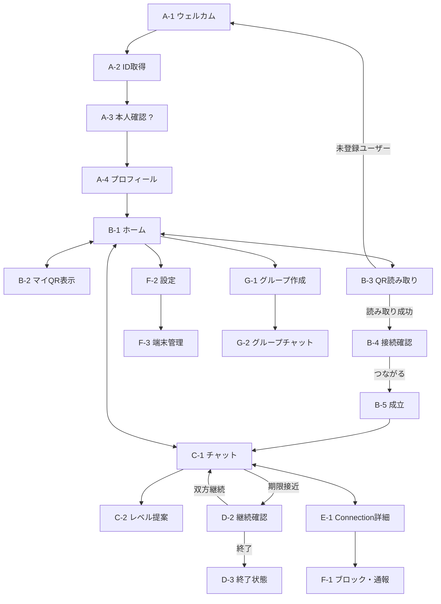
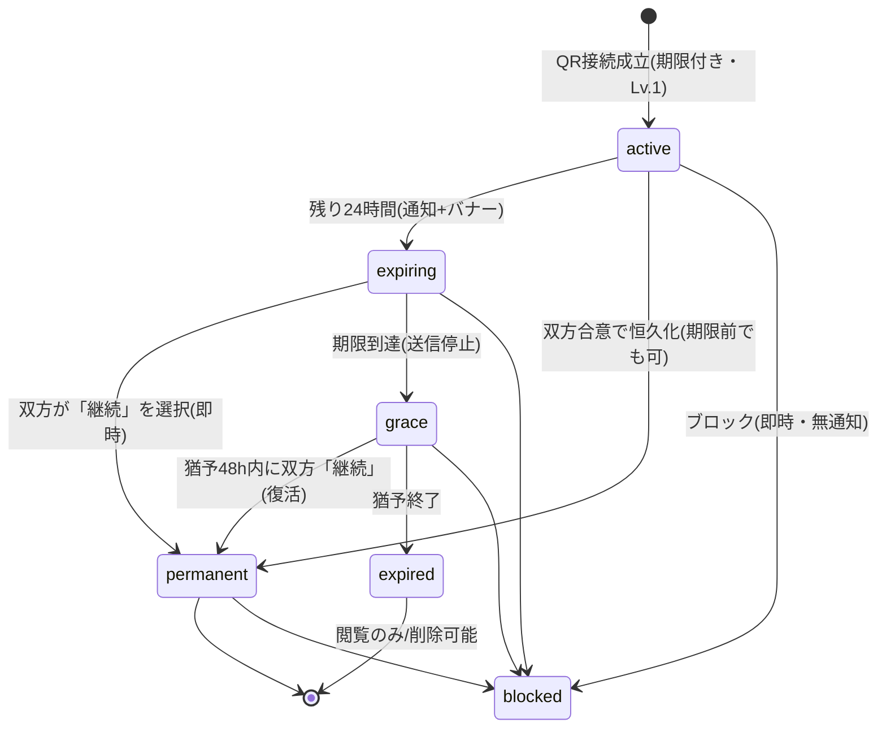

# PersonalLink 画面設計書(MVP仕様書)

**Version 0.1.5 / 2026年8月**(変更履歴は文末)

本書は [構想書 v0.1](./00-vision.md) の「次にやること」を実行したもの。

コアループ

```
QR表示 → QR読み取り → Connection成立 → チャット → 7日間 → 継続確認 → Connection Level上昇
```

を、ユーザーが実際に触る画面単位で設計する。本書がそのまま **Phase 1(Web版MVP)の仕様書**となる。

対象環境: スマートフォンブラウザ最適化のWebアプリ(Phase 2でのPWA化を前提としたSPA構成)。

関連文書: [02-data-model.md](./02-data-model.md)(データモデル)/ [prototype/index.html](../prototype/index.html)(クリック可能プロトタイプ)

---

## 1. 構想書からの設計判断(Design Decisions)

構想書は思想を定義し、本書はそれを仕様に落とす。その際に必要になった判断を先に明示する。**構想と食い違う場合はここが根拠となる。**

### D-1: 「期限」と「レベル」は独立した2軸として実装する

構想書のLevel 5「恒久的なConnection」は、データモデル上は **期限の撤廃(`expires_at = null`)** として実装する。

理由: 「ずっとつながっていたいが、写真共有はまだ」という関係が現実に存在するため。期限(いつまで)と共有範囲(どこまで)は別の意思決定である(憲法第五条)。

UI上はレベル表示 `Lv.1〜Lv.4` に加えて、期限バッジ(⏳残りn日 / ♾恒久)を常に併記する。構想書のLevel 5は「♾恒久」バッジとして表現される。

### D-2: QR読み取り → 即成立(読み取り側の確認1タップのみ)

QRを見せる行為そのものが「接続を許可する意思表示」であるため、表示側の追加承認は不要。読み取り側は接続確認画面(B-4)で相手の公開プロフィールを見て「つながる」を1タップ → 成立。

なりすまし・スクリーンショット悪用対策として、QRのペイロードは**短命(5分)の署名付きワンタイムトークン**とする。イベント会場の電波状況を考慮し、表示側はオフラインでも直近取得済みトークンを表示できる(読み取り側はオンライン必須)。

### D-3: 「継続しない」は相手に通知しない

継続確認で「継続しない」を選んでも、相手には**通知せず、選択内容も開示しない**。相手側には自然な期限到達として「期限が終了しました」とだけ表示される。

理由: 「断る気まずさ」がこのサービスの解決したい課題の一部。ネガティブな選択は常に沈黙で処理する(ブロックも同様)。逆に、双方が「継続」を選んだ瞬間は**即座に恒久化して祝う**(ポジティブは即時、ネガティブは期限まで秘匿)。

### D-4: 期限到達後に48時間の猶予期間(grace)を置く

期限到達で送信は即停止するが、その後48時間は閲覧と継続選択が可能。猶予内に双方が「継続」を選べば復活して恒久化する。

理由: イベント後、双方が同じタイミングでアプリを開くとは限らない。「うっかり失効」で関係が消えるのは構想の意図ではない。ただしデフォルトは終了(オプトイン継続)— 「残したい関係だけ残す」に忠実。

### D-5: レベルの解放は双方合意、停止は一方的に即時

- L2以上の機能解放: どちらかが**提案** → 相手が**承諾**で発効。
- 承諾しない場合は「今はしない」(保留)であり、拒否通知は送られない(提案側には「提案中」とだけ見える)。D-3と同じ思想。
- 共有の**停止**(レベルを下げる・自分の詳細プロフィール公開をやめる)は一方的に即時可能。安全側に倒す(憲法第一条・第五条)。

### D-6: MVPでは Level 3(音声・通話)は「準備中」表示

構想書のMVP必須機能に通話は含まれないため、レベル定義には存在するがUI上ロック+「今後のアップデートで解放」と表示する。レベル体系の一貫性を保ちつつスコープを絞る。

### D-7: 認証方式 — **未定(TBD)**

> ⚠️ **v0.1.4 で変更**: 当初は「電話番号・メールアドレスを一切収集しない(`@ID + Passkey`)」と決めていたが、
> **Passkey は運用が面倒との判断で見送りとなった**。代替方式は未定。

**現在の確定事項**(方式に依存しない部分)

- 識別子は `@ID`(Universal ID)。これは変わらない
- セッションは**サーバー側(DBセッション)**で管理する。MVP必須機能⑩「全端末ログアウト」が即時 revoke を要求するため、方式が何であれこれは必須
- アカウント回復手段を必ず1つ持つ

**未定事項**: ログイン時に本人であることをどう確かめるか。

**この判断が波及する範囲**(方式を決めるときに一緒に決める必要がある)

| 影響先 | 内容 |
|---|---|
| **憲法第二条(最小収集)** | Passkey は「電話番号もメールも持たない」を可能にしていた。メール/SMS を採る場合、**収集する個人情報が増える**。憲法に反するわけではないが、「必要のない情報は集めない」の"必要"の線引きを引き直すことになる |
| **A-1 サブコピー** | 「電話番号もメールも不要。」が使えなくなる可能性がある |
| **キラー体験(§4-B)** | イベント会場で60秒登録。メール確認リンクやSMS到達を挟むと、**会場の電波状況とアプリ切替が摩擦になる**。方式選定の主要な評価軸はここ |
| **A-3 画面** | 内容が方式によって変わる(下記 A-3 参照) |
| **リカバリー設計** | 方式によって回復手段の重要度が変わる |

方式が決まり次第、本節と A-1 / A-3 / F-3、データモデル §credentials、[T-4](./05-tech-stack.md) を同時に更新する。

### D-8: 既読表示はしない

配信状態(送信済み)のみ表示し、既読は表示しない。中間領域の人間関係に既読プレッシャーは不向き。「気軽につながれる」ことが価値の核。

### D-9: MVPではE2E暗号化を実装しない(ただし移行を妨げない)

マルチデバイス鍵同期の複雑さのため、E2EEはPhase 3(Universal Identity 基盤)と同時に導入する。MVPは通信路暗号化+保存時暗号化。データモデルはE2EE移行を妨げない形にする(憲法第十一条への段階的アプローチとして、仕様書に明記して正直に運用する)。

### D-10: メッセージ本文のスキャン・解析は行わない

KPI「LINE移行率」の計測のために本文からLINE IDパターンを検出する、といった実装は**行わない**(憲法第二条違反)。代理指標で計測する(§6参照)。

### D-11: グループには期限・レベルを設けない(v0.1)

グループはConnection済みの相手のみ招待できる合意済みの場とし、レベル非依存(テキスト・写真とも可)。「イベント参加者の期限付きグループ」は魅力的だが v0.2 で検討。

### D-12: 送信取り消しは24時間以内・内容は物理削除・通知しない

自分が送ったメッセージ(テキスト・写真・ファイル)は、**送信から24時間以内**なら相手の画面からも取り消せる。

- 取り消し後は双方のタイムラインに「送信を取り消しました」のトゥームストーンだけが残る(誰が取り消したかは吹き出しの向きで自明なため追加表示しない)
- 取り消し時、本文・添付ファイルは**サーバーから物理削除**する(憲法第六条: 忘れる権利)。フラグ削除ではない
- 取り消しを相手に**プッシュ通知しない**(「何かが消された」ことをわざわざ知らせて詮索を誘わない — D-3と同じ沈黙の原則)
- 「**自分の画面から削除**」(相手側には残る)は別機能として併設し、操作メニューで常に両方を提示して違いを明記する
- 終了済み(expired)の接続では取り消し不可(閲覧のみの凍結状態を変更しない)。active / grace / permanent では可

### D-13: ミュートメッセージ(通知を鳴らさない送信)は送信者側にだけ見える

入力バーのトグル(🔔⇄🌙)でミュート送信モードに切り替えられる。ONの間に送ったメッセージは、相手に**プッシュ通知・音・バナーを出さずに**届く(未読バッジとアプリ内の新着表示は通常どおり)。

- **受信側には「ミュートで送られた」ことを表示しない**。🌙マークは送信者側の吹き出しにのみ付く。送り手の配慮を「気を使わせている」という相手への圧に変換しないため(D-8 既読なしと同じ思想)
- 通知の抑止は**サーバー側**で行う(Pushを送らない)。受信クライアントにミュートフラグは配信しない
- 深夜・早朝・休日に「相手の時間を奪わずに送っておく」という、中間領域の関係にとって最重要のユースケースを支える

### D-14: QRの中身は URL の**フラグメント**にする

QRに埋め込むのは `https://<host>/i#<token>` という**URL**とし、トークンは `#` 以降(フラグメント)に置く。

**なぜURLか**: **標準のカメラアプリで読める**。未登録の相手がその場でブラウザを開けることは、
イベント会場での成立率に直結する(キラー体験)。独自形式にすると、相手が先にアプリを入れている必要がある。

**なぜフラグメントか**: フラグメントは**サーバーに送信されない**。アクセスログにも Referer にもトークンが残らない。
[T-9](./05-tech-stack.md)「QRトークンをURLに載せない」の意図を、URLの利点を捨てずに満たせる。
クライアント側で `location.hash` を読み、POST でサーバーへ渡す。

### D-15: 表示名に敬称を付け足さない

「◯◯さんとつながりました」のように、システム側で「さん」を付けない。表示名はユーザーが自由に決める値で、
すでに「田中さん」と設定している人もいる。付け足すと「田中さんさん」になる(S2の実装中に実際に発生した)。

### D-16: 終了タイミングは選択によらず常に同じにする

継続確認の選択(継続 / 継続しない / 未選択)が何であっても、**終了は常に猶予終了時**に行う。

**理由**: D-3 は「どちらを選んだかは相手に通知しない」だが、**通知しなくてもタイミングが漏らす**。
「継続しない」だけ早く終了すると、相手は猶予期間の有無から選択を推測できる。
沈黙で処理するというのは、観測可能な差をゼロにするということ。

**副作用として受け入れること**: 「継続しない」を選んでも、すぐには終わらず猶予終了まで
接続が残る(送信は期限で止まる)。早く切りたい場合はブロックを使う。

---

## 2. 画面一覧(全体マップ)

| ID | 画面名 | パス | コアループ |
|----|--------|------|:----:|
| A-1 | ウェルカム | `/welcome` | |
| A-2 | Universal ID取得 | `/signup/id` | |
| A-3 | 本人確認の設定(**方式未定**) | `/signup/auth` | |
| A-4 | プロフィール設定 | `/signup/profile` | |
| B-1 | ホーム(Connection一覧) | `/home` | ● |
| B-2 | マイQR表示 | `/qr`(表示タブ) | ● |
| B-3 | QR読み取り | `/qr`(読み取りタブ) | ● |
| B-4 | 接続確認 | `/connect/confirm` | ● |
| B-5 | Connection成立 | (B-4上のオーバーレイ) | ● |
| C-1 | チャット(1対1) | `/c/:id` | ● |
| C-2 | レベル提案モーダル | (C-1上のモーダル) | ● |
| C-3 | メッセージ操作メニュー | (C-1上のシート) | |
| C-4 | ミュート送信モード | (C-1 入力バーの状態) | |
| D-1 | 期限接近バナー・通知 | (C-1 / B-1 内) | ● |
| D-2 | 継続確認 | `/c/:id/renewal` | ● |
| D-3 | 接続終了状態 | (C-1 の expired 状態) | ● |
| E-1 | Connection詳細 | `/c/:id/info` | ● |
| F-1 | ブロック・通報 | (E-1上のモーダル) | |
| F-2 | 設定 | `/settings` | |
| F-3 | 端末・セッション管理 | `/settings/devices` | |
| G-1 | グループ作成 | `/groups/new` | |
| G-2 | グループチャット | `/g/:id` | |

### 画面遷移図



---

## 3. Connectionの状態遷移

Connectionのライフサイクルが本サービスの心臓部。実装は必ずこの状態機械に従う。



### 継続確認の評価マトリクス

継続の選択は期限24時間前(expiring)から猶予終了(grace end)まで受け付ける。評価ルール:

| あなた \ 相手 | 継続 | 継続しない | 未選択 |
|---|---|---|---|
| **継続** | ♾ 恒久化(そろった瞬間に即時) | 猶予終了で終了 | 猶予終了で終了 |
| **継続しない** | 猶予終了で終了 | 猶予終了で終了 | 猶予終了で終了 |
| **未選択** | 猶予終了で終了 | 猶予終了で終了 | 猶予終了で終了 |

> 📌 **v0.1.5 で修正**(S4実装時の発見)。当初は「継続しない」が絡むと*期限で*、
> 「未選択」なら*期限+猶予で*終了する、と終了タイミングを分けていた。
> しかしこれは **D-3 を破る**。猶予期間が無かったことから、相手は
> 「あの人は継続しないを選んだ」と推測できてしまう。**通知しなくても、タイミングが漏らす。**
> → **終了は常に猶予終了時。観測可能な差をゼロにする**([D-16](#d-16-終了タイミングは選択によらず常に同じにする))。

重要な不変条件(D-3):

- **終了のタイミングは選択内容によらず常に同じ**(猶予終了時)。早いか遅いかで拒否が漏れないようにする。
- 終了時の表示は選択内容に関わらず常に「**期限が終了しました**」で統一する。
- 双方の「継続」がそろった場合のみ、**即座に**恒久化し、システムメッセージで祝う。
- 選択は**あとから変えられる**(気が変わることはある)。変更も相手には通知しない。

---

## 4. 画面仕様

各画面を「目的 / 表示要素 / アクションと遷移 / 状態・エッジケース / 計測イベント」で定義する。

---

### A. オンボーディング

登録は**60秒以内**に完了する設計とする。キラー体験(イベント会場でのQR交換)では、未登録の相手を目の前で待たせながら登録することになるため、ここの速度がQR接続率を直接左右する。

#### A-1 ウェルカム `/welcome`

**目的**: 価値を一言で伝え、登録またはログインへ振り分ける。

**表示要素**
- ロゴ / サービス名
- キャッチコピー「**LINEを教える前に、つながろう。**」
- サブコピー(**方式未定のため確定できない**。Passkey前提だった「電話番号もメールも不要。」は使えない可能性がある — D-7)
- ボタン: [はじめる](主)/ [ログイン](副)
- **QR読み取り経由の場合**: 「`@tanaka` さんとつながるためにアカウントを作成します」と相手のアバター・表示名を表示(接続チケットを保持したまま登録フローへ。§B-3参照)

**アクションと遷移**
- [はじめる] → A-2
- [ログイン] → 本人確認(**方式未定**)→ B-1。失敗時: 回復導線へ

**状態・エッジケース**
- ログイン済みでアクセス → B-1へリダイレクト
- 方式が対応していない環境への案内文(方式決定後に確定)

**計測**: `welcome_viewed {via_qr}` / `signup_started {via_qr}`

#### A-2 Universal ID取得 `/signup/id`

**目的**: `@ID`(Universal Identity の入口)を取得する。

**表示要素**
- 入力欄: `@` プレフィックス固定 + ハンドル入力
- リアルタイム重複チェック(✓利用可能 / ✗使用中 / 候補提示)
- ルール表示: 3〜20文字、英小文字・数字・`_`。後から変更可(90日に1回)
- 注記: 「これはあなたの公開IDです。表示名(ニックネーム)は次の画面で別に設定できます」

**アクションと遷移**
- [次へ](利用可能時のみ活性)→ A-3

**状態・エッジケース**
- 予約語(`admin` 等)・不適切語はサーバー側で拒否
- ID変更後、旧IDは90日間再取得不可(なりすまし防止)
- **日本語入力(IME)対応(必須)**: 日本語キーボードのまま入力される前提で作る。①変換中(`compositionstart`〜`compositionend`)は入力欄のDOMを再生成しない・値を書き換えない — 変換状態が壊れて文字化けする。②全角文字が入った場合は「使えない文字です」ではなく「**半角英数字で入力してください(日本語入力をオフに切り替えてください)**」と原因と対処を示す。③`autocapitalize="none" autocorrect="off" spellcheck="false"` を指定。同様に、チャット入力の送信は変換確定のEnter(`isComposing === true`)で発火させない

**計測**: `id_submitted`

#### A-3 本人確認の設定 `/signup/auth` — **仕様未定(TBD)**

**目的**: ログイン手段の確立とアカウント回復手段の確保。

> ⚠️ **方式が未定のため、本節は空欄**(D-7)。Passkey 版の仕様は v0.1.3 の履歴を参照。

**方式に依存せず確定している要件**(何を選んでも満たすこと)

| # | 要件 | 根拠 |
|---|---|---|
| 1 | この画面を含めて**登録全体が60秒以内**に終わること | A章冒頭。イベント会場で相手を待たせながら登録するため |
| 2 | **イベント会場の電波・アプリ切替に耐えること** | キラー体験(§4)。他アプリへの往復が必要な方式は、会場での成立率を直接下げる |
| 3 | アカウント回復手段が**必ず1つ**あること | 回復不能はサービスの信頼を損なう |
| 4 | 回復の実行時に**全端末ログアウト**が走ること | 乗っ取り時の被害を止める |
| 5 | 収集する情報を**最小限にとどめ、何を集めるか画面上で明示**すること | 憲法第二条 |

**計測**(方式が決まったら具体化): `auth_setup_completed` / `recovery_prepared`

#### A-4 プロフィール設定 `/signup/profile`

**目的**: Level 0(公開プロフィール)の最小設定。プライバシー教育を兼ねる。

**表示要素**
- 表示名(必須。本名である必要はない旨を明記)
- アイコン(任意。プリセットアバター12種 or 画像アップロード)
- ひとこと(任意、50文字)
- 枠外注記: 「ここに入力した内容は **Level 0(公開)** です。あなたのQRを読み取った相手に表示されます。それ以外の情報は、あなたが許可するまで誰にも共有されません」

**アクションと遷移**
- [はじめる] → B-1(QR経由の場合は B-4 接続確認へ直行)

**計測**: `signup_completed {via_qr, duration_sec}` — 60秒以内完了率を追う

---

### B. ホームとQR接続(キラー体験)

#### B-1 ホーム(Connection一覧)`/home`

**目的**: すべてのConnectionの起点。期限という時間軸を可視化する。

**表示要素**
- ヘッダー: 自分のアバター + `@ID`(タップでF-2 設定)
- **[QR] ボタン(最重要・最大サイズ、画面下部中央固定)** → B-2/B-3
- 「まもなく期限」セクション(expiring のConnectionを最上部に。⏳残り時間バッジ)
- Connection一覧: アバター / 表示名 / 最終メッセージ抜粋 / 未読バッジ / 期限バッジ(⏳n日 or ♾)
- タブ: [つながり中] / [終了済み](expired。閲覧・削除のみ可)
- グループは同一リストに表示(グループアイコンで区別)
- 空状態: 「まだConnectionがありません。イベントで会った人にQRを見せてみましょう」+ [QRを表示]

**アクションと遷移**
- 行タップ → C-1(グループは G-2)
- [QR] → B-2(前回使ったタブを記憶)
- 行長押し → クイックメニュー(ミュート / 削除)

**ソート**: expiring(期限接近順)> 未読 > 最終アクティビティ降順

**計測**: `home_viewed` / `qr_button_tapped`

#### B-2 マイQR表示 `/qr`(「マイQR」タブ)

**目的**: コアループの起点。「連絡先を渡す」のではなく「接続条件を提示する」画面。

**表示要素**
- QRコード(大)。ペイロード = 署名付きワンタイムトークン(有効5分、残り時間リング表示、自動更新)
- 自分のアバター / 表示名 / `@ID`
- **接続条件チップ(タップで変更)**: 期限 [1日 / **7日(デフォルト)** / 30日]
- 注記: 「読み取った相手とは **Level 1(メッセージのみ)** でつながります」
- 画面輝度を自動ブースト(イベント会場対策)

**アクションと遷移**
- 期限チップ変更 → 以後このQRで成立するConnectionに適用(ユーザーごとに記憶)
- タブ切替 → B-3

**状態・エッジケース**
- オフライン: 直近取得済みトークンを表示 + 「オフライン: このQRは HH:MM まで有効」(D-2)
- トークン失効(5分)+オフライン継続: 「電波のある場所で開き直してください」

**計測**: `qr_displayed {duration_ttl}` / `qr_expiry_changed {days}`

#### B-3 QR読み取り `/qr`(「読み取り」タブ)

**目的**: 相手のQRを読み、接続確認へ。

**表示要素**
- カメラビュー(初回はカメラ権限の説明 → 要求)
- ガイド枠 + 「相手のQRを読み取ってください」
- フォールバック: [IDで接続] → `@ID` 直接入力(カメラ不調・権限拒否時)

**アクションと遷移**
- 有効トークン読み取り → B-4
- **未ログイン状態で読み取り**(相手の端末で自分がまだ未登録の場合の逆パターン含む): トークンを「接続チケット」としてセッションに保持 → A-1(via_qr)→ 登録完了後 B-4 へ直行。**キラー体験の要**: イベント会場でその場で登録して接続まで完了する
- `@ID` 入力での接続요청はMVPでは**QR同等の即成立にしない**: 相手に承認リクエストが飛ぶ(QRと違い、本人が目の前で許可した文脈がないため)

**状態・エッジケース**
- 失効トークン: 「QRの有効期限が切れています。相手に再表示してもらってください」
- 無関係のQR: 「PersonalLinkのQRではありません」
- 自分自身のQR: 「自分のQRです」
- 既存Connectionの相手: B-4をスキップし該当チャットへ(トースト「すでにつながっています」)

**計測**: `qr_scanned {result: ok|expired|invalid|self|already_connected}` / `scan_requires_signup`

#### B-4 接続確認 `/connect/confirm`

**目的**: 接続前に「何が共有され、何が共有されないか」を明示する。サービスの思想が最も凝縮される画面。

**表示要素**
- 相手のLevel 0公開プロフィール: アバター / 表示名 / `@ID` / ひとこと
- 接続条件カード:
  - ⏳ 期限: **7日間**(相手が設定した値)
  - 🔓 共有されるもの: 公開プロフィールのみ
  - 🔒 **共有されないもの: 電話番号・メールアドレス・LINE ID**(←このコピーが核心)
- ボタン: [つながる](主)/ [やめる](副)

**アクションと遷移**
- [つながる] → Connection作成(status: active, level 1, expires_at: now+7d)→ B-5
- [やめる] → B-3(表示側には何も通知しない)

**計測**: `connect_confirm_viewed` / `connection_established {expiry_days}` — **QR接続率**の分子

#### B-5 Connection成立(オーバーレイ)

**目的**: 成立を祝い、即座に会話を始めさせる(初回メッセージ率に直結)。

**表示要素**
- 双方のアバターが接続されるアニメーション
- 「**田中さんとつながりました** ⏳7日間」
- [メッセージを送る](主)/ [あとで](副)
- **表示側(QRを見せた側)** にはプッシュ+アプリ内通知: 「佐藤さんとつながりました」→ タップでC-1

**アクションと遷移**
- [メッセージを送る] → C-1(入力欄フォーカス済み)

**計測**: `connection_celebrated` / 通知: `connect_notification_sent`

---

### C. チャット

#### C-1 チャット(1対1)`/c/:id`

**目的**: 会話の場であり、期限とレベルという「関係の状態」が常に見える場。

**表示要素**
- ヘッダー: 相手アバター / 表示名 / **期限バッジ(⏳残りn日 / ♾)** — タップでE-1
- メッセージリスト:
  - テキスト(L1)
  - 画像・ファイル(L2解放時のみ)
  - **システムメッセージ**(中央寄せ・グレー): 成立 / レベル解放 / 恒久化 / 期限終了 などの関係イベントをタイムラインに刻む
- 入力バー: テキスト入力 / [📷 写真] / [📎 ファイル] / [🔔⇄🌙 ミュート切替](C-4)/ [送信]
  - L2未解放時、📷📎は🔒付きで表示 → タップでC-2(レベル提案モーダル)。**隠すのではなくロック表示にする**(次のレベルの存在を自然に学習させる)
- 配信状態は「送信済み」のみ。既読表示なし(D-8)。ミュートで送った自分のメッセージには「🌙 ミュートで送信済み」
- 取り消されたメッセージ: 「送信を取り消しました」のトゥームストーン(破線・グレー)

**アクションと遷移**
- ヘッダー → E-1
- 🔒付きボタン → C-2
- メッセージの吹き出しをタップ(長押しではなくタップ。発見性優先)→ C-3
- expiring時: 上部にD-1バナー

**状態・エッジケース**
- grace(期限到達後48h): 入力バーを「期限が終了しました。48時間以内なら継続できます [継続確認へ]」に差し替え。閲覧は可能
- expired: D-3参照
- blocked(自分がブロックした): 入力バー非表示 + 「ブロック中」表示
- 相手にブロックされている場合: **通常表示のまま**。送信は成功したように見えるが相手に届かない(silent block、D-3と同思想)

**計測**: `message_sent {type}` / `first_message_sent {hours_since_connect}` — **初回メッセージ率**(成立後24h以内に双方向のやり取りが発生した率)

#### C-2 レベル提案モーダル

**目的**: 双方合意によるレベル解放(D-5)。関係を深める行為を軽量な儀式にする。

**表示要素(提案側)**
- 「**写真・ファイル共有を解放しますか?**」
- 説明: 「相手が承諾すると、お互いに写真やファイルを送れるようになります(Lv.2)」
- [提案する] / [キャンセル]
- 提案後: 対象機能ボタンに「提案中」表示。**再提案は72時間に1回まで**(催促スパム防止)

**表示要素(受信側)**
- チャット内に承諾カード: 「田中さんが写真・ファイル共有(Lv.2)を提案しています」[承諾する] / [今はしない]
- 「今はしない」→ カードは折りたたまれ、**相手に拒否通知は送られない**(D-5)

**アクションと遷移**
- 承諾 → 即時発効。システムメッセージ「📷 写真・ファイル共有が解放されました(Lv.2)」+ 双方に通知
- Lv.3(通話)はMVPでは「準備中」表示で提案不可(D-6)
- Lv.4(詳細プロフィール)も同フロー。承諾すると詳細プロフィール(F-2で設定した項目)が相互公開

**計測**: `level_proposed {level}` / `level_accepted {level, hours_to_accept}`

#### C-3 メッセージ操作メニュー(ボトムシート)

**目的**: 送信取り消し(D-12)と自分側削除を、違いが分かる形で提供する。

**表示要素**
- 対象メッセージの種別表示(自分のメッセージ / 相手のメッセージ / 取り消し済み)
- **自分の未取り消しメッセージの場合**:
  - [送信取り消し] + 説明「相手の画面からも消え、『送信を取り消しました』とだけ表示されます」
  - 24時間超過時・expired時は非活性 + 理由を表示(「送信から24時間以内のみ取り消せます」/「終了した接続では取り消せません」)
- **全メッセージ共通**: [自分の画面から削除] + 説明「相手の画面には残ります」
- [キャンセル]

**アクションと遷移**
- [送信取り消し] → 確認なしで即実行(トゥームストーン化はそれ自体が取り消し可能性の低い操作だが、誤タップ被害が軽微なため確認を挟まない。誤送信直後の1秒を争うユースケースを優先)→ トースト「送信を取り消しました」
- [自分の画面から削除] → 即実行 → トースト「自分の画面から削除しました(相手側には残ります)」

**状態・エッジケース**
- 相手が取り消したメッセージ: 受信側のタイムラインでもトゥームストーンに置換(リアルタイム反映)。プッシュ通知はしない(D-12)
- 通報時の「直近メッセージ20件」(F-1)には取り消し済みメッセージの本文は**含まれない**(物理削除済みのため)。トゥームストーンの存在のみ含まれる
- システムメッセージは操作対象外(タップしても何も起きない)

**計測**: `message_retracted {age_min, kind}` / `message_deleted_for_me {kind}`

#### C-4 ミュート送信モード(入力バーの状態)

**目的**: 相手の通知を鳴らさずに送る(D-13)。

**表示要素**
- 入力バーの🔔ボタン。タップで🌙(ON)に切り替わり、背景色が変わる+入力欄プレースホルダーが「🌙 ミュートで送信」になる(モードが一目で分かる)
- 初回ON時のみトースト: 「通知を鳴らさずに送ります。夜間や、返信を急かしたくないときに」

**アクションと遷移**
- ONの間の送信(テキスト・写真・ファイル)はすべてミュート送信。OFFにするまで持続(会話ごとに保持)
- 送信者側の吹き出しに「🌙 ミュートで送信済み」

**状態・エッジケース**
- 受信側: プッシュ・音・バナーなし。未読バッジ・ホームの新着表示は通常どおり(気づけないと困る)
- 受信側のUIにはミュートの痕跡を一切出さない(D-13)
- グループチャット(G-2)でも同様に使用可能(v0.1では1対1のみ実装し、グループはv0.2)

**計測**: `mute_mode_enabled` / `message_sent {type, muted}`

---

### D. 期限と継続

#### D-1 期限接近(バナー・通知)

**目的**: 期限を「切れる前に」意識させ、継続確認へ誘導する。

**仕様**
- 期限24時間前: 双方にプッシュ通知「田中さんとの接続が明日で期限になります」
- C-1上部にバナー: 「⏳ この接続はあと24時間で期限になります [継続確認へ]」
- B-1の「まもなく期限」セクションに昇格表示

**計測**: `expiry_warning_sent` / `expiry_banner_tapped`

#### D-2 継続確認 `/c/:id/renewal`

**目的**: 「残したい関係だけ残す」意思決定の画面。構想書の思想的中核。

**表示要素**
- 相手カード: アバター / 表示名 / つながってからの日数
- ふりかえり: 「7日間で 24通 のメッセージを交わしました」(自分のデータの要約のみ。相手側の閲覧行動などは表示しない)
- 「**田中さんとの接続を継続しますか?**」
- 説明: 「お互いが継続を選ぶと、期限のないConnectionになります。継続しない場合、期限が来ると接続は終了します。**どちらを選んだかは相手に通知されません**」
- ボタン: [継続する](主)/ [継続しない](副・グレー)/ [あとで決める](テキストリンク)

**アクションと遷移**
- [継続する] → 自分の選択を記録。相手未選択なら「継続を選びました。相手の選択を待っています」(**相手には通知しない** — 催促圧力を作らないため。ただし相手側のD-1バナーは表示され続ける)
- 双方「継続」がそろった瞬間 → **恒久化**。C-1に🎉システムメッセージ「このConnectionは恒久になりました ♾」+ 双方に通知
- [継続しない] → 記録のみ。期限時刻に自然終了(D-3)。以後この接続のD-1通知は自分には出ない
- [あとで決める] → C-1へ戻る(バナー継続)

**状態・エッジケース**
- grace期間中もこの画面に入れる(「あと36時間以内なら継続できます」)
- 恒久化提案は期限前でもE-1から可能(同じ双方合意フロー)

**計測**: `renewal_viewed` / `renewal_choice {continue|end|later}` / `connection_permanent {trigger: renewal|proposal, days_since_connect}` — **期限後継続率**の分子

#### D-3 接続終了状態(expiredのC-1)

**目的**: 終了を静かに、後腐れなく扱う。

**表示要素**
- チャットは**閲覧のみ**。末尾にシステムメッセージ「この接続は期限を迎えました」(どちらの選択によるものかは表示しない — D-3不変条件)
- 入力バーの代わりに: 「接続は終了しています」+ [履歴を削除]
- B-1では「終了済み」タブに移動

**アクションと遷移**
- [履歴を削除] → 確認 → 自分側の履歴を完全削除(憲法第六条)。相手側の履歴には影響しない
- 再接続はいつでも可能: もう一度QRを読めば**新しいConnection**として成立(過去の履歴は引き継がない)

**計測**: `connection_expired` / `expired_history_deleted` / `reconnection_established`

---

### E. Connection Level

#### E-1 Connection詳細 `/c/:id/info`

**目的**: この相手との「関係の現在地」を1画面で把握・操作する。

**表示要素**
- 相手プロフィール(現在のレベルで見える範囲)
- **レベルゲージ**: Lv.0〜4の段階表示 + 期限バッジ(⏳残りn日 / ♾恒久)
- 機能リスト:
  - ✅ メッセージ(Lv.1)
  - 🔒 写真・ファイル(Lv.2)[提案する] ← 解放済みなら✅
  - 🔒 音声・通話(Lv.3)「準備中」
  - 🔒 詳細プロフィール(Lv.4)[提案する]
- [♾ 恒久化を提案](期限付きの場合のみ。D-2と同じ双方合意フロー)
- 共有の停止: 解放済みレベルの [共有を停止](一方的・即時、D-5)
- 危険域: [ブロック] / [通報] / [このConnectionを削除]

**計測**: `connection_info_viewed` / `permanent_proposed` / `level_revoked {level}`

---

### F. 安全と設定

#### F-1 ブロック・通報(モーダル)

**ブロック**
- 即時発効。**相手には一切通知されず、相手側のUIは変化しない**(silent block)。相手の送信は成功したように見えるが届かない
- ブロック解除は設定から可能。解除しても過去の未達メッセージは配信されない

**通報**
- カテゴリ選択(なりすまし / 迷惑行為 / 不適切なコンテンツ / その他)+ 任意詳細
- 「直近のメッセージ20件を運営に提供する」**同意チェック**(デフォルトOFF)。ユーザーの明示同意がある場合のみ本文を提供(D-10・憲法第二条と両立する通報設計)
- 送信後: 「通報を受け付けました」+ ブロックの同時提案

**計測**: `block_created` / `report_submitted {category, with_messages}`

#### F-2 設定 `/settings`

- プロフィール編集: **Level 0(公開)** と **Level 4(詳細)** をセクション分けして編集(詳細: 本名 / SNSリンク / 誕生日など、すべて任意)
- QRデフォルト期限の変更
- 通知設定
- セキュリティ: [端末・セッション管理](F-3)/ [リカバリーコード再発行]
- データ: [エクスポート](全データJSON一括、憲法第六条)/ [アカウント削除](即時・完全)
- ブロックリスト管理

#### F-3 端末・セッション管理 `/settings/devices`

**目的**: 「どの端末でも自分」の安全弁。共有端末時代(Phase 5)の基礎。

**表示要素**
- ログイン中セッション一覧: 端末名 / 最終アクセス / 現在の端末マーク
- ログイン手段の一覧(**方式未定**。方式によって「登録済みの鍵」「連携済みの連絡先」など内容が変わる)
- [**全端末からログアウト**](MVP必須機能⑩。現在の端末を残すか選択可)

**計測**: `logout_all_executed`

---

### G. グループチャット

MVP必須機能⑤。コアループ外のため最小仕様(D-11)。

#### G-1 グループ作成 `/groups/new`

- グループ名(必須)+ アイコン(任意)
- メンバー選択: **activeまたはpermanentなConnectionの相手のみ**(終了済み・grace中は不可)
- 作成 → G-2へ。招待された側は通知 + 参加確認(勝手に入れない)

#### G-2 グループチャット `/g/:id`

- テキスト・写真・ファイル可(レベル非依存、D-11)
- メンバー一覧 / 退出 / (作成者のみ)メンバー削除・グループ削除
- **グループ内の相手とは1対1のConnectionレベルは変化しない**(グループでの同席は1対1の信頼とは別)
- 1対1Connectionが期限終了した相手ともグループ内では会話継続可(グループは独立した合意の場)

---

## 5. 通知一覧

| タイミング | 通知先 | 内容 | 備考 |
|---|---|---|---|
| Connection成立 | QR表示側 | 「◯◯さんとつながりました」 | |
| メッセージ受信 | 受信者 | 標準的なメッセージ通知 | プレビューON/OFF設定可 |
| ミュートメッセージ受信 | — | **プッシュ・音・バナーなし**(未読バッジのみ) | D-13。受信側にミュートの痕跡を出さない |
| 送信取り消し | — | **通知しない**(受信側の画面は静かに置換) | D-12 |
| レベル提案 | 受信側 | 「◯◯さんがLv.nを提案しています」 | |
| レベル承諾 | 提案側 | 「Lv.nが解放されました」 | |
| 期限24時間前 | 双方 | 「明日で期限になります」 | 「継続しない」選択済みの本人には出さない |
| 恒久化成立 | 双方 | 「♾ 恒久のConnectionになりました」 | |
| 接続終了 | — | **通知しない**(D-3) | |
| ブロック | — | **通知しない** | |
| 新端末ログイン | 本人の全端末 | 「新しい端末でログインしました」 | セキュリティ通知 |

MVPはアプリ内通知+Web Push(許可された場合)。未許可でもアプリ内で完結する。

---

## 6. KPI計測設計(構想書§16 → イベント定義)

| KPI | 定義 | 使用イベント |
|---|---|---|
| **QR接続率** | `connection_established` ÷ `qr_displayed`(表示セッション単位) | B-2, B-4 |
| **初回メッセージ率** | 成立後24h以内に双方向のメッセージが発生したConnection ÷ 成立数 | C-1 |
| **期限後継続率** | `connection_permanent(trigger: renewal)` ÷ 期限到達Connection数 | D-2 |
| **再利用率** | 初回接続から7日以内に2回目以降のQR表示/読み取りを行ったユーザー率 | B-2, B-3 |
| **LINE移行率(代理指標)** | ①恒久化後30日メッセージ継続率(会話がここに残っているか) ②終了時の任意1問アンケート「この人とは他のアプリでつながりましたか?」 | D-10により本文スキャンは行わない |

すべての計測イベントは**メタデータのみ**(本文・画像は含めない)。イベントスキーマは実装時に `docs/analytics-events.md` として分離予定。

---

## 7. MVP範囲外(再確認)

構想書§13のとおり: AI秘書 / 決済 / SNSタイムライン / スタンプ大量 / ゲーム / ニュース / 広告 / ハードウェア。
加えて本書の判断により: 音声・通話(D-6)/ E2EE(D-9)/ グループの期限・レベル(D-11)/ `@ID`検索によるオープンな発見機能(接続はQRまたはID直接入力のみ。検索可能にすると「公開SNS」化して中間領域の思想が壊れる)。

---

## 8. 実装への次のアクション(提案)

1. ~~技術選定メモの作成~~ → **完了**([docs/05-tech-stack.md](./05-tech-stack.md))
2. **スプリント分割案**:
   - S1: 認証基盤(A-1〜A-4、F-3)— Universal ID + セッション管理 + **本人確認(方式未定 = D-7)**
   - S2: QR接続(B-1〜B-5)— トークン発行・署名検証・Connection作成
   - S3: チャット(C-1)— メッセージ送受信(まずポーリング → SSE/WS)
   - S4: 期限エンジン(D-1〜D-3)— 状態遷移ジョブ・通知・継続確認
   - S5: レベル + 安全機能(C-2、E-1、F-1、F-2)
   - S6: グループ(G-1、G-2)+ 計測イベント実装
3. **プロトタイプによるユーザーテスト**: `prototype/index.html` をイベント参加経験者5名に触ってもらい、B-4の文言(「共有されないもの」)とD-2の選択率を定性確認

---

## 変更履歴

| Version | 日付 | 内容 |
|---|---|---|
| 0.1 | 2026-08 | 初版(コアループ全画面・設計判断D-1〜D-11・KPI計測設計) |
| 0.1.1 | 2026-08 | A-2にIME(日本語入力)対応要件を追記。**送信取り消し(D-12・C-3)とミュートメッセージ(D-13・C-4)を追加** |
| 0.1.2 | 2026-08 | ビジュアルを「NEON-HUD」デザイン言語へ刷新(データストリーム流体背景・半透明HUDパネル・AR透過モード)。詳細は [03-design-language.md](./03-design-language.md) |
| 0.1.3 | 2026-08 | デザインを白ベース「GLASS-HUD」へ変更(オーナー指定)。透過構造・流体背景は維持 |
| 0.1.4 | 2026-08 | **D-14(QRはURLのフラグメント)**と **D-15(敬称を付け足さない)** を追加。いずれも S2 の実装中に判明した |
| 0.1.5 | 2026-08 | **§3の評価マトリクスを修正**。終了タイミングの差から相手の選択が推測できる(D-3が破れる)ため、**終了は常に猶予終了時**に統一した。根拠を **D-16** として追加 |
