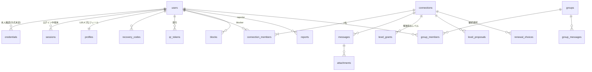

# PersonalLink データモデル設計

**Version 0.2 / 2026年8月**(S1前半の実装に合わせて更新)

> 実装は [web/src/db/schema.ts](../web/src/db/schema.ts)。S1で追加した点は各節に「S1で追加」と明記した。

[画面設計書(01-screen-design.md)](./01-screen-design.md) の仕様を支えるデータモデル。Phase 1(Web版MVP)対象。RDB(PostgreSQL想定)。

---

## 1. ER図

---

## 2. テーブル定義

### users

| カラム | 型 | 備考 |
|---|---|---|
| id | uuid PK | |
| handle | text UNIQUE | `@ID`(小文字英数と`_`、3〜20)|
| handle_changed_at | timestamptz | 変更は90日に1回 |
| created_at / deleted_at | timestamptz | 削除は物理削除を基本(憲法第六条)。deleted_atは削除処理の猶予管理用 |

**S1の実装**: handle の UNIQUE は `deleted_at IS NULL` の**部分UNIQUE**。
形式(`^[a-z0-9_]{3,20}$`)は **CHECK制約**でDBにも刻む — APIを経由しない経路でも壊れないようにするため。

**収集しないもの(憲法第二条)**: 電話番号 / メールアドレス / 氏名(L4詳細プロフィールにユーザーが任意入力する場合を除く)/ 端末の連絡先帳 / 位置情報。

### credentials(本人確認)— **スキーマ未定(TBD)**

> ⚠️ **Passkey は見送りとなり、認証方式は未定**([D-7](./01-screen-design.md))。
> このテーブルの具体的なカラムは方式決定後に定める。当初の Passkey 版スキーマは v0.1 の履歴を参照。

方式に依存せず確定している点:

- `user_id` に紐づく **0..N 件**の本人確認手段を持てる構造にする(端末追加・手段の複数持ちに対応するため)
- 秘密情報(パスワード等)を保持する方式を選ぶ場合は、**必ずハッシュ化**して保存する(平文カラムを作らない)
- `created_at` / `last_used_at` / 表示用ラベルは方式によらず持つ

**セッションと分離しておくこと**: `sessions` は方式に依存しない(下記)。認証方式が変わっても
「全端末ログアウト」の実装は影響を受けない設計にする。

### sessions

| カラム | 型 | 備考 |
|---|---|---|
| id | uuid PK | |
| user_id | uuid FK | |
| **token_hash** | text UNIQUE | **S1で追加**。Cookieに入れる不透明トークンの sha256。トークン本体は保存しない — DBが漏れてもセッションを乗っ取れないようにするため |
| device_label | text | 「iPhone (Safari)」等。端末識別ではなく F-3 で見分けるための粗い分類にとどめる(憲法第二条)|
| expires_at | timestamptz | **S1で追加**。既定90日 |
| created_at / last_seen_at / revoked_at | timestamptz | 「全端末ログアウト」= 一括revoke |

**認証方式に依存しない**(T-4)。方式が決まってもこのテーブルと実装は変更不要。

### recovery_codes

| カラム | 型 | 備考 |
|---|---|---|
| user_id | uuid FK | |
| code_hash | text | Argon2。平文は発行時のみ表示・保存しない |
| used_at | timestamptz | 使用は1回。使用時に全セッションrevoke+再発行 |

### handle_reservations(**S1で追加**)

| カラム | 型 | 備考 |
|---|---|---|
| handle | text PK | 手放された handle |
| previous_user_id | uuid FK NULL | 手放した本人。本人だけは予約期間中でも取り戻せる |
| released_at | timestamptz | |
| reserved_until | timestamptz | この時刻を過ぎたら誰でも取得できる(既定90日)|

仕様書 A-2 の「ID変更後、旧IDは90日間再取得不可(なりすまし防止)」を満たすには
旧 handle を覚えておく必要がある。データモデル v0.1 に無かったため S1 で追加した。

### profiles

| カラム | 型 | 備考 |
|---|---|---|
| user_id | uuid PK/FK | |
| display_name | text | **L0** |
| avatar_url | text | **L0** |
| bio | text(50) | **L0** |
| detail | jsonb | **L4**(本名/SNSリンク/誕生日など、全項目任意)|

L0とL4の区分はカラムレベルで固定し、APIレスポンス組み立て時に相手との `level_grants` を必ず参照する(レベル判定をクライアントに任せない)。

### qr_tokens

| カラム | 型 | 備考 |
|---|---|---|
| id | uuid PK | ワンタイムトークンID |
| user_id | uuid FK | 表示者 |
| expiry_days | int | 1 / 7 / 30(このQRで成立するConnectionの期限)|
| issued_at | timestamptz | 有効期間 = issued_at + 5分 |
| consumed_at / consumed_by | timestamptz / uuid | 使用済み管理(ワンタイム)。**未消費のものだけを更新する条件付きUPDATE**で奪い合うため、同時に2人が読んでも1人しか成立しない |

QRペイロード = `token_id + サーバー署名(HMAC)`。読み取り側APIで署名・有効期限・consumed を検証する
(`issued_at` / `expiry_days` はDBから引くため、ペイロードに載せる必要がなかった)。

**QRに載せるのは `https://<host>/i#<payload>` というURL**([D-14](./01-screen-design.md))。
フラグメントなのでサーバーに送信されず、アクセスログに残らない。

### connections

| カラム | 型 | 備考 |
|---|---|---|
| id | uuid PK | |
| status | enum | `active` / `grace` / `permanent` / `expired` |
| **pair_key** | text | **S2で追加**。2人のIDを昇順に連結した値。「同一ペアの生きたConnectionは最大1つ」(不変条件7)を**部分UNIQUEでDBに刻む**ために持つ。connection_members と重複するが、制約を効かせるにはこの形が要る |
| expires_at | timestamptz NULL | **NULL = 恒久**(設計判断D-1)|
| grace_until | timestamptz NULL | expires_at + 48h |
| established_at | timestamptz | |
| ended_at | timestamptz NULL | |

`expiring`(残り24h)は状態ではなく `expires_at - now < 24h` の導出値。状態遷移は分単位のバッチジョブ+読み取り時の遅延評価の二重化で駆動する。

**S2の実装**: 不変条件3(`expires_at = NULL` ⟺ `permanent`)を **CHECK制約**で、
不変条件7を **`status <> 'expired'` の部分UNIQUE**でDBに刻んだ。どちらもテストで検証済み。

### connection_members

| カラム | 型 | 備考 |
|---|---|---|
| connection_id | uuid FK | |
| user_id | uuid FK | |
| hidden_at | timestamptz NULL | 自分側の履歴削除(相手側には影響しない)|
| **last_read_at** | timestamptz NULL | **S3で追加**。B-1の未読バッジ用。⚠️ **相手には絶対に返さない** — これは既読情報そのもので、漏らすと D-8 が壊れる |

(connection_id, user_id) UNIQUE。1つのConnectionに必ず2行。同一ペアの `active/grace/permanent` なConnectionは同時に1つまで(部分UNIQUE制約)。expired後の再接続は新規行。

### level_grants(解放済みレベル)

| カラム | 型 | 備考 |
|---|---|---|
| connection_id | uuid FK | |
| level | int | 2 / 3 / 4 |
| granted_at | timestamptz | |
| revoked_at | timestamptz NULL | 停止は一方的・即時(D-5)。revoked_byを記録 |

Level 1(メッセージ)は成立時に暗黙付与のためレコード不要。

### level_proposals

| カラム | 型 | 備考 |
|---|---|---|
| connection_id | uuid FK | |
| level | int | |
| proposed_by | uuid FK | |
| proposed_at | timestamptz | 再提案は72hに1回(アプリ層で制御)|
| accepted_at | timestamptz NULL | 承諾で level_grants 作成。「今はしない」はレコード変更なし(拒否状態を持たない=D-5)|

### renewal_choices(継続選択)

| カラム | 型 | 備考 |
|---|---|---|
| connection_id | uuid FK | |
| user_id | uuid FK | |
| choice | enum | `continue` / `end` |
| chosen_at | timestamptz | |

**不変条件(D-3)**: `end` はいかなるAPIレスポンスにも相手側に返さない。双方 `continue` がそろった時のみ即時 `permanent` 化。`end` があっても終了処理は自然な `expires_at` まで実行しない。

### messages / attachments

| messages | 型 | 備考 |
|---|---|---|
| id | uuid PK | |
| connection_id | uuid FK | |
| sender_id | uuid FK | |
| kind | enum | `text` / `image` / `file` / `system` |
| body | text NULL | E2EE移行時は暗号文カラムに置換予定(D-9)|
| muted | boolean | ミュート送信(D-13)。**送信者にのみAPIで返し、受信側には配信しない**。通知抑止はサーバー側(Push未送信)で実施 |
| created_at | timestamptz | |
| retracted_at | timestamptz NULL | 送信取り消し(D-12)。取り消し時に body を NULL 化し attachments を**物理削除**。行はトゥームストーンとして保持 |
| deleted_by | uuid[] | 自分側削除。相手の画面には残る |

**S3の実装**: 以下を **CHECK制約**でDBに刻んだ。アプリが消し忘れても、DBが書き込みを拒否する。

| 制約 | 守るもの |
|---|---|
| `retracted_at is null or body is null` | **取り消し済みなら本文は残っていない**(D-12: フラグ削除ではなく物理削除) |
| `(kind = 'system') = (sender_id is null)` | システムメッセージに送信者はいない / 通常メッセージには必ずいる |
| `kind <> 'system' or muted = false` | システムメッセージはミュートになりえない |

**既読カラムは存在しない**(D-8)。相手が読んだかを保存する場所そのものを作っていない。
未読バッジ用の `connection_members.last_read_at` は**自分側の情報**で、APIから相手に返さない。

attachments: id / message_id / storage_key / mime / size / created_at。`image`/`file` の送信APIは **level_grants(level=2, revoked_at IS NULL) の存在を必ず検証**。

システムメッセージ(成立/レベル解放/恒久化/期限終了)も messages(kind=system)としてタイムラインに永続化。

### blocks

| カラム | 型 | 備考 |
|---|---|---|
| blocker_id / blocked_id | uuid FK | UNIQUE複合 |
| created_at | timestamptz | |

Silent block: 被ブロック側の送信APIは**正常応答**を返し、配信のみ抑止する。既存Connectionのstatusは変更しない(状態変化が漏洩シグナルになるため)。

### reports

reporter_id / reported_id / connection_id / category / detail / evidence_message_ids(**同意時のみ**、D-10)/ created_at。

### groups / group_members / group_messages

groups: id / name / icon_url / owner_id / created_at。
group_members: group_id / user_id / joined_at / left_at(招待→参加確認制)。
group_messages: messagesと同構造(レベル検証なし=D-11)。

---

## 3. 主要な不変条件まとめ

1. メッセージ送信可 ⟺ connection.status ∈ {active, permanent} かつ 送信者が非ブロック対象
2. 画像・ファイル送信可 ⟺ 上記 + level 2 が granted かつ未revoke(1対1のみ。グループは対象外)
3. `expires_at = NULL` ⟺ status = permanent
4. `renewal_choices.choice = 'end'` は相手に一切露出しない(APIレベルで保証)
5. 相手のL4プロフィール参照可 ⟺ level 4 granted かつ未revoke
6. grace中: 送信不可・閲覧可・renewal_choices受付可
7. 同一ペアの生きたConnection(active/grace/permanent)は最大1つ
8. 送信取り消し可 ⟺ 送信者本人 かつ `created_at` から24時間以内 かつ status ≠ expired。取り消し時に本文・添付を物理削除し、取り消しのプッシュ通知は送らない(D-12)
9. `muted` は受信側クライアントに一切露出しない。取り消し済みメッセージの本文・添付は通報時の証跡(evidence)にも含まれない — 物理削除済みのため含めようがない、を保証する(D-12・D-13)

---

## 4. プライバシー対応表(People OS憲法 → 実装)

| 憲法 | 実装 |
|---|---|
| 第二条(最小収集) | 連絡先帳・位置情報を持つカラムが存在しない。計測イベントはメタデータのみ。**電話番号・メールを持つかは認証方式の決定に依存(D-7)** |
| 第五条(段階的公開) | profiles の L0/L4 カラム分離 + level_grants によるサーバー側判定 |
| 第六条(忘れる権利) | hidden_at(自分側削除)/ deleted_by / アカウント物理削除 / 全データJSONエクスポート |
| 第十一条(信用不要) | **認証方式が未定のため再評価が必要**(Passkeyは「パスワードを預からない」を満たしていた)/ D-9のとおりE2EEはPhase 3で導入、それまで本仕様書で正直に開示 |
